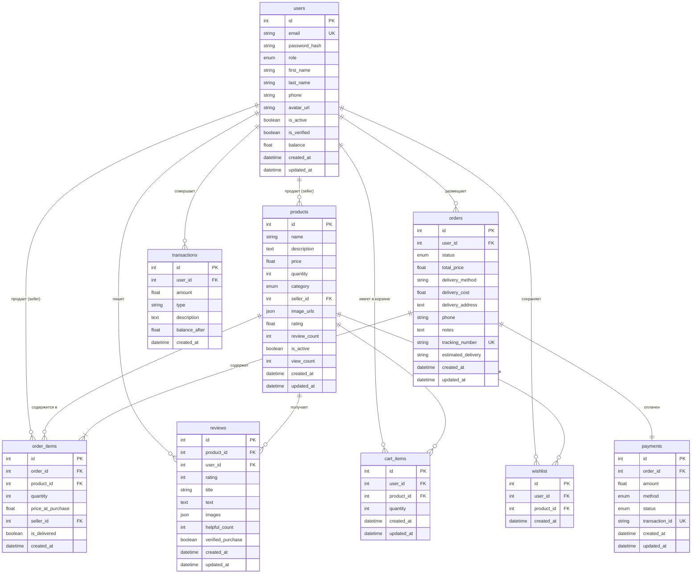

# ER-диаграмма базы данных SaudaFlow

## Структура базы данных (9 таблиц)

## Связи между таблицами

### 1. users (Пользователи)
- **Исходящие связи:**
  - `products.seller_id` → users.id (1:M) - Продавец и его товары
  - `orders.user_id` → users.id (1:M) - Покупатель и его заказы
  - `reviews.user_id` → users.id (1:M) - Автор и его отзывы
  - `cart_items.user_id` → users.id (1:M) - Корзина пользователя
  - `wishlist.user_id` → users.id (1:M) - Избранное пользователя
  - `transactions.user_id` → users.id (1:M) - Транзакции кошелька
  - `order_items.seller_id` → users.id (1:M) - Продавец позиции заказа

### 2. products (Товары)
- **Входящие связи:**
  - seller_id → users.id (M:1) - Принадлежность продавцу
- **Исходящие связи:**
  - `order_items.product_id` → products.id (1:M)
  - `reviews.product_id` → products.id (1:M)
  - `cart_items.product_id` → products.id (1:M)
  - `wishlist.product_id` → products.id (1:M)

### 3. orders (Заказы)
- **Входящие связи:**
  - user_id → users.id (M:1) - Покупатель заказа
- **Исходящие связи:**
  - `order_items.order_id` → orders.id (1:M) - Позиции заказа
  - `payments.order_id` → orders.id (1:1) - Оплата заказа

### 4. order_items (Позиции заказов)
- **Входящие связи:**
  - order_id → orders.id (M:1)
  - product_id → products.id (M:1, RESTRICT) - Нельзя удалить товар если есть в заказах
  - seller_id → users.id (M:1)

### 5. reviews (Отзывы)
- **Входящие связи:**
  - product_id → products.id (M:1, CASCADE)
  - user_id → users.id (M:1, CASCADE)

### 6. payments (Платежи)
- **Входящие связи:**
  - order_id → orders.id (1:1, CASCADE) - Один платеж на один заказ

### 7. wishlist (Избранное)
- **Входящие связи:**
  - user_id → users.id (M:1, CASCADE)
  - product_id → products.id (M:1, CASCADE)
- **Ограничения:**
  - UNIQUE(user_id, product_id) - Один товар один раз в избранном

### 8. cart_items (Корзина)
- **Входящие связи:**
  - user_id → users.id (M:1, CASCADE)
  - product_id → products.id (M:1, CASCADE)

### 9. transactions (Транзакции кошелька)
- **Входящие связи:**
  - user_id → users.id (M:1, CASCADE)

## Enums (Перечисления)

### UserRole
- `customer` - Покупатель
- `seller` - Продавец
- `admin` - Администратор

### OrderStatus
- `pending` - Ожидает обработки
- `processing` - В обработке
- `shipped` - Отправлен
- `delivered` - Доставлен
- `cancelled` - Отменен

### PaymentMethod
- `card` - Банковская карта
- `wallet` - Виртуальный кошелек
- `cash` - Наличные

### PaymentStatus
- `pending` - Ожидает
- `completed` - Завершен
- `failed` - Ошибка
- `refunded` - Возврат

### ProductCategory
- `electronics` - Электроника
- `clothing` - Одежда
- `food` - Продукты
- `books` - Книги
- `other` - Другое

## Индексы

Для оптимизации производительности созданы индексы на:
- `users.email` (UNIQUE)
- `products.name`
- `products.category`
- `products.seller_id`
- `orders.user_id`
- `orders.status`
- `order_items.order_id`
- `order_items.product_id`
- `reviews.product_id`
- `reviews.user_id`
- `payments.order_id` (UNIQUE)
- `wishlist.user_id`
- `wishlist.product_id`
- `cart_items.user_id`
- `cart_items.product_id`
- `transactions.user_id`

## Каскадное удаление (CASCADE)

При удалении пользователя (users):
- Удаляются его отзывы (reviews)
- Удаляется его корзина (cart_items)
- Удаляется его избранное (wishlist)
- Удаляются его транзакции (transactions)
- Удаляются его заказы (orders) → что удаляет позиции (order_items) и платежи (payments)
- НО товары (products) НЕ удаляются (надо отдельно обработать)

## Статистика

- **Всего таблиц:** 9
- **Всего связей:** 13
- **Всего enum типов:** 5
- **Всего индексов:** ~20
